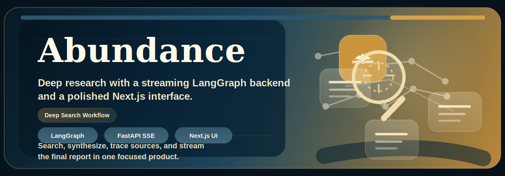
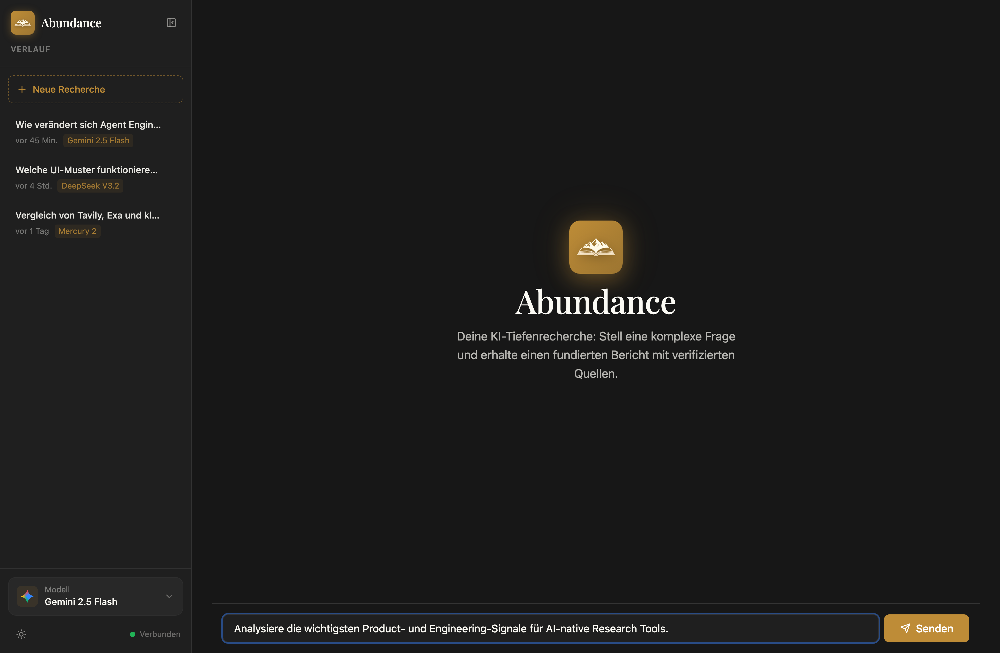
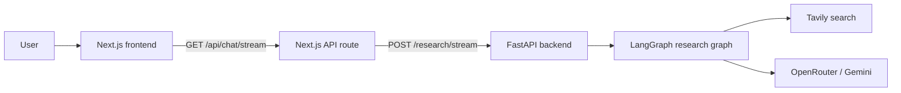

<p align="center">
  
</p>

<p align="center">
  
</p>

<h1 align="center">Abundance</h1>

<p align="center">
  AI-powered deep research with a streaming LangGraph backend, a polished Next.js interface, and source-aware report generation.
</p>

<p align="center">
  <a href="#architecture">Architecture</a> ·
  <a href="#interface-preview">Preview</a> ·
  <a href="#features">Features</a> ·
  <a href="#quick-start">Quick Start</a> ·
  <a href="#repository-layout">Repository Layout</a> ·
  <a href="#security-notes">Security</a>
</p>

<p align="center">
  <a href="https://github.com/ChrBoebel/Abundance/actions/workflows/ci.yml"></a>
  
  
  
  
  
  
</p>

Abundance is a full-stack research assistant that takes a user question, breaks it into research steps, runs web-backed investigation, and streams the final write-up into a live chat interface.

The repository is structured as a compact monorepo:

- `backend/` contains the FastAPI server, LangGraph workflow, model routing, and search integration.
- `frontend/` contains the authenticated UI, stream handling, report rendering, and session flow.

## Interface Preview

<p align="center">
  
</p>

<p align="center">
  Dark-mode interface with persistent research history, branded navigation, and a focused chat workspace.
</p>

## Features

- Multi-step research orchestration with LangGraph
- Streaming backend responses over Server-Sent Events
- Live frontend progress indicators, source tracking, and final report rendering
- Tavily-backed web research with model-driven synthesis
- Password-gated interface for private demos and local deployments
- Docker-friendly local backend setup

## Why It Works For A Portfolio

- It combines product design, backend orchestration, API integration, and frontend streaming UX in one project.
- The architecture is understandable at a glance but still demonstrates non-trivial system design.
- The repo is split cleanly into backend and frontend surfaces, which makes it easy for reviewers to navigate.

## Architecture



## Stack

- Frontend: Next.js 14, React 18, TypeScript, Tailwind CSS
- Backend: FastAPI, LangGraph, Python
- Model routing: OpenRouter
- Search: Tavily

## Quick Start

### 1. Start the backend

```bash
cd backend
cp .env.example .env
```

Set at least these variables in `backend/.env`:

- `OPENROUTER_API_KEY`
- `TAVILY_API_KEY`

Then start the backend:

```bash
docker-compose up --build
```

The API will be available at `http://localhost:8000`.

### 2. Start the frontend

```bash
cd frontend
cp .env.example .env
npm install
npm run dev
```

Set these variables in `frontend/.env`:

- `RESEARCH_BACKEND_URL=http://localhost:8000`
- `SESSION_SECRET=<random secret>`
- `APP_PASSWORD=<local password>`

The UI runs at `http://localhost:4290`.

## Repository Layout

| Area | Purpose |
| --- | --- |
| `backend/backend_server.py` | FastAPI entrypoint and SSE bridge |
| `backend/src/open_deep_research/` | LangGraph workflow, prompts, model utilities, research logic |
| `frontend/app/` | Next.js routes, pages, and server endpoints |
| `frontend/components/` | UI building blocks for chat, streaming state, and report display |
| `frontend/lib/` | Auth, session, research stream mapping, and shared types |
| `assets/` | Repository presentation assets for GitHub |

```text
.
├── assets/
├── backend/
│   ├── backend_server.py
│   ├── docker-compose.yml
│   ├── README.md
│   └── src/open_deep_research/
├── frontend/
│   ├── app/
│   ├── components/
│   ├── lib/
│   ├── public/
│   └── README.md
└── README.md
```

## Development Notes

- The frontend expects the backend SSE endpoint at `POST /research/stream`.
- Authentication is intentionally simple and based on a single password for private demos.
- The repository uses local `.env` files only; example files are provided for both apps.

## Security Notes

- Do not commit `.env` files.
- Rotate any previously used API keys before publishing if they were ever committed in private history.
- Verify `backend/.env.example` and `frontend/.env.example` stay placeholder-only.

## License

MIT. See [LICENSE](LICENSE).
