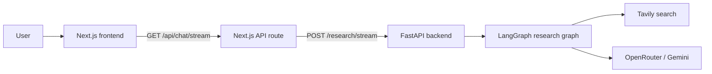

# Abundance

Abundance is a full-stack deep research application that streams multi-step web research from a LangGraph-powered FastAPI backend into a Next.js interface.

The repository is structured as a small monorepo:

- `backend/` contains the research graph, model integration, and SSE API.
- `frontend/` contains the authenticated UI and the client-side event stream handling.

## Highlights

- Multi-step research workflow built with LangGraph
- FastAPI streaming backend with Server-Sent Events
- Next.js frontend with live research progress updates
- Tavily-backed web search
- Password-protected UI session flow
- Docker-based backend workflow for local development

## Architecture



## Stack

- Frontend: Next.js 14, React 18, TypeScript, Tailwind CSS
- Backend: FastAPI, LangGraph, Python
- Model routing: OpenRouter
- Search: Tavily

## Local Setup

### 1. Backend

```bash
cd backend
cp .env.example .env
```

Set at least these variables in `backend/.env`:

- `OPENROUTER_API_KEY`
- `TAVILY_API_KEY`

Then start the backend:

```bash
docker-compose up --build
```

The API will be available at `http://localhost:8000`.

### 2. Frontend

```bash
cd frontend
cp .env.example .env
npm install
npm run dev
```

Set these variables in `frontend/.env`:

- `RESEARCH_BACKEND_URL=http://localhost:8000`
- `SESSION_SECRET=<random secret>`
- `APP_PASSWORD=<local password>`

The UI runs at `http://localhost:4290`.

## Project Structure

```text
.
├── backend/
│   ├── backend_server.py
│   ├── docker-compose.yml
│   ├── README.md
│   └── src/open_deep_research/
├── frontend/
│   ├── app/
│   ├── components/
│   ├── lib/
│   ├── public/
│   └── README.md
└── README.md
```

## Development Notes

- The frontend expects the backend SSE endpoint at `POST /research/stream`.
- Authentication is intentionally simple and based on a single password for private demos.
- The repository uses local `.env` files only; example files are provided for both apps.

## Publication Checklist

- Do not commit `.env` files.
- Rotate any previously used API keys before publishing if they were ever committed in private history.
- Verify `backend/.env.example` and `frontend/.env.example` stay placeholder-only.

## License

MIT. See [LICENSE](LICENSE).
