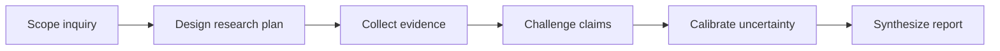
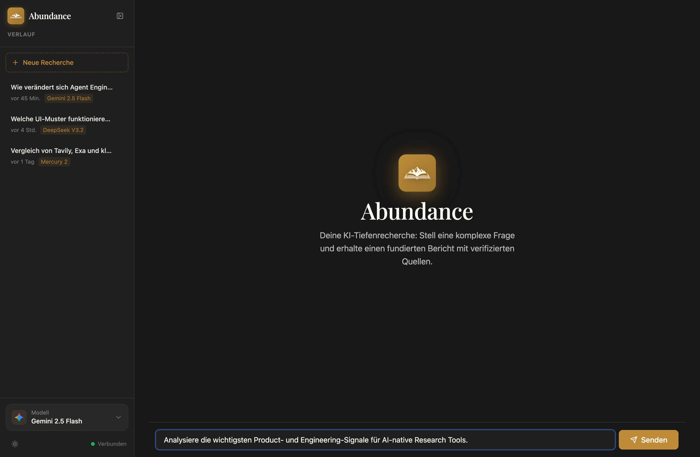
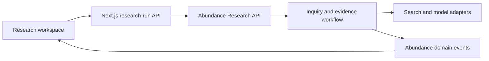

<p align="center">
  
</p>

<p align="center">
  
</p>

<h1 align="center">Abundance</h1>

<p align="center">
  Turn complex questions into inspectable conclusions with evidence,
  counterevidence, calibrated confidence, and traceable sources.
</p>

<p align="center">
  <a href="#how-abundance-researches">Method</a> ·
  <a href="#interface">Interface</a> ·
  <a href="#architecture">Architecture</a> ·
  <a href="#quick-start">Quick Start</a> ·
  <a href="#open-source-foundation">Acknowledgements</a>
</p>

<p align="center">
  <a href="https://github.com/ChrBoebel/Abundance/actions/workflows/ci.yml"></a>
  
  
  
  
</p>

Abundance is an evidence-oriented research workspace. Instead of treating search
results as a finished answer, it exposes a deliberate path from a scoped inquiry
to supporting evidence, credible challenges, limitations, and a final synthesis.

## How Abundance researches


```mermaid
flowchart LR
    Inquiry["Scope inquiry"] --> Plan["Design research plan"]
    Plan --> Evidence["Collect evidence"]
    Evidence --> Review["Challenge claims"]
    Review --> Confidence["Calibrate uncertainty"]
    Confidence --> Report["Synthesize report"]
```

The method is built around five product-level stages:

1. **Inquiry** — identify scope and material assumptions.
2. **Planning** — define evidence questions and falsification paths.
3. **Evidence** — prioritize primary, current, and independent sources.
4. **Review** — connect claims to support, counterevidence, and limitations.
5. **Synthesis** — report what the evidence warrants and what remains open.

Abundance streams these stages through a stable domain event contract. The web
application never depends on internal graph node names.

## Interface

<p align="center">
  
</p>

The workspace includes:

- a visible research trail from inquiry to synthesis;
- quick, balanced, and thorough research modes;
- persistent local research history;
- source-aware Markdown reports and citation navigation;
- optional advanced model selection;
- an authenticated interface and live backend health status.

## Architecture


```mermaid
flowchart LR
    Browser["Research workspace"] --> WebAPI["Next.js research-run API"]
    WebAPI --> DomainAPI["Abundance Research API"]
    DomainAPI --> Workflow["Inquiry and evidence workflow"]
    Workflow --> Providers["Search and model adapters"]
    Workflow --> Events["Abundance domain events"]
    Events --> Browser
```

The Python package is organized under `abundance_research`. LangGraph is a
workflow runtime behind the application boundary; the public API uses Abundance
concepts such as inquiries, evidence, review stages, and reports.

| Area | Responsibility |
| --- | --- |
| `backend/src/abundance_research/domain.py` | Inquiry, evidence, claims, uncertainty, reports |
| `backend/src/abundance_research/events.py` | Stable streaming event contract |
| `backend/src/abundance_research/planning.py` | Inquiry scoping and research planning |
| `backend/src/abundance_research/investigation.py` | Focused evidence collection and review |
| `backend/src/abundance_research/coordination.py` | Parallel evidence-question coordination |
| `backend/src/abundance_research/evaluation.py` | Deterministic report-quality metrics |
| `frontend/app/` | Research workspace and authenticated routes |
| `frontend/lib/research.ts` | Research-run lifecycle and API integration |

See [docs/architecture.md](docs/architecture.md) for the internal contracts.

## Quick Start

### Backend

```bash
cd backend
cp .env.example .env
pip install -e ".[dev]"
python3 backend_server.py
```

Set at least:

- `OPENROUTER_API_KEY`
- `TAVILY_API_KEY`

Alternatively:

```bash
cd backend
docker compose up --build
```

The API runs at `http://localhost:8000`. Its primary streaming endpoint is:

```text
POST /api/v1/research-runs/stream
```

### Frontend

```bash
cd frontend
cp .env.example .env
npm ci
npm run dev
```

Set:

- `RESEARCH_BACKEND_URL=http://localhost:8000`
- `SESSION_SECRET=<random secret>`
- `APP_PASSWORD=<local password>`

The workspace runs at `http://localhost:4290`.

## Quality checks

```bash
cd backend
python -m ruff check backend_server.py src tests
python -m pytest -q

cd ../frontend
npm run lint
npm run typecheck
npm run build
```

Backend evaluation covers claim-to-evidence links, challenged-claim coverage,
primary-source share, broken evidence references, and open questions.

## Configuration

Research modes select bounded coordination and search budgets. Runtime fields can
also be overridden using `ABUNDANCE_*` environment variables, for example:

```bash
ABUNDANCE_MAX_SEARCH_ITERATIONS=6
ABUNDANCE_MAX_COORDINATION_ITERATIONS=4
```

Model and search provider credentials retain their standard provider-specific
environment variable names.

## Security

- Never commit `.env` files or real provider keys.
- Rotate a key immediately if it appears in Git history or logs.
- The password gate is intended for private demos, not multi-user authorization.
- Review [SECURITY.md](SECURITY.md) before exposing the application publicly.

## Open-source foundation

The original backend was based on
[`langchain-ai/open_deep_research`](https://github.com/langchain-ai/open_deep_research)
under the MIT License. Abundance preserves that provenance while maintaining its
own namespace, product API, evidence domain, prompts, workspace, evaluation, and
runtime integrations.

See [THIRD_PARTY_NOTICES.md](THIRD_PARTY_NOTICES.md) for the source baseline and
copyright notice.

## License

MIT. See [LICENSE](LICENSE).
