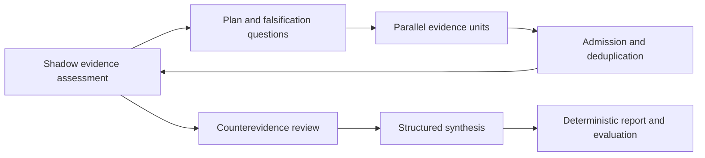
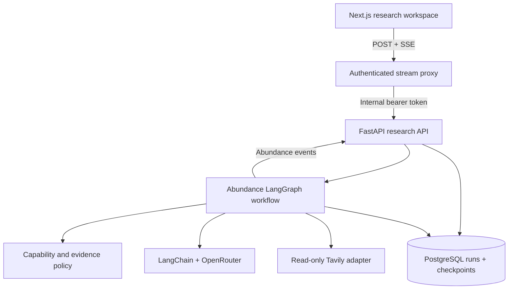

<p align="center">
  
</p>

<h1 align="center">Abundance</h1>

<p align="center">
  Evidence-led research with explicit counterevidence, calibrated confidence,
  traceable sources, and an inspectable workflow.
</p>

<p align="center">
  <a href="https://github.com/ChrBoebel/Abundance/actions/workflows/ci.yml"></a>
  
  
  
  
</p>

Abundance turns a complex inquiry into a bounded research run. It plans
falsifiable evidence questions, collects read-only web evidence in parallel,
admits only policy-compliant sources, and produces a structured report whose
citations can reference only admitted evidence.

## Why this architecture

- **Deterministic workflow:** LangGraph controls known stages and concurrency;
  the model does not decide which external capability may run.
- **Evidence boundary:** retrieved text is untrusted data. URL admission,
  deduplication, citation binding, and report rendering are enforced in code.
- **Stable product protocol:** clients receive Abundance events, never internal
  LangGraph node events or provider exceptions.
- **Provider abstraction:** LangChain's `ChatOpenRouter` integration supplies
  schema-constrained planning and synthesis without tool binding.
- **Cancellation end to end:** browser disconnects propagate through Next.js,
  FastAPI, LangGraph, and active provider calls.
- **Durable operations:** PostgreSQL stores run status, public reports,
  evaluation metrics, feedback, capability shares, and LangGraph checkpoints.

## Product capabilities

- persistent research history with offline local fallback;
- structured source filters for supporting evidence, counterevidence, and
  primary sources;
- per-claim feedback with optimistic, accessible status updates;
- Markdown export and print-optimized PDF saving;
- privacy-minimized capability links for read-only report sharing;
- side-by-side synthesis comparison with quality, latency, token, and cost
  signals.

## Research flow


```mermaid
flowchart LR
    Q["Inquiry"] --> P["Plan and falsification questions"]
    P --> F["Parallel evidence units"]
    F --> A["Admission and deduplication"]
    A --> Q["Shadow evidence assessment"]
    Q --> R["Counterevidence review"]
    R --> S["Structured synthesis"]
    S --> E["Deterministic report and evaluation"]
```

The user-facing modes select hard budgets:

| Mode | Evidence units | Results per unit | Search concurrency | Total evidence |
| --- | ---: | ---: | ---: | ---: |
| Quick | 3 | 3 | 1 | 9 |
| Balanced | 6 | 5 | 3 | 30 |
| Thorough | 10 | 8 | 5 | 60 |

## System overview


```mermaid
flowchart TB
    Browser["Next.js research workspace"]
    BFF["Authenticated stream proxy"]
    API["FastAPI research API"]
    Graph["Abundance LangGraph workflow"]
    Policy["Capability and evidence policy"]
    Model["LangChain + OpenRouter"]
    Search["Read-only Tavily adapter"]
    DB[("PostgreSQL runs + checkpoints")]

    Browser -->|"POST + SSE"| BFF
    BFF -->|"Internal bearer token"| API
    API --> Graph
    Graph --> Policy
    Graph --> Model
    Graph --> Search
    API --> DB
    Graph --> DB
    Graph -->|"Abundance events"| API
```

Key modules:

| Path | Responsibility |
| --- | --- |
| `backend/src/abundance_research/domain.py` | Inquiry, evidence, claim, and report models |
| `backend/src/abundance_research/application/graph.py` | Typed LangGraph topology and nodes |
| `backend/src/abundance_research/application/policy.py` | Code-enforced budgets and source admission |
| `backend/src/abundance_research/application/evidence_assessment.py` | Quote binding, content fingerprints, and shadow quality summaries |
| `backend/src/abundance_research/adapters/` | LangChain/OpenRouter and Tavily integrations |
| `backend/src/abundance_research/events.py` | Stable streaming event contract |
| `backend/src/abundance_research/persistence.py` | Run, feedback, and capability-share persistence |
| `backend/src/abundance_research/eval_harness.py` | Reference-dataset and live quality evaluation |
| `frontend/app/api/research-runs/stream/` | Authenticated, cancellation-aware BFF proxy |
| `frontend/lib/research-records.ts` | Runtime-safe persisted-report adapters |
| `frontend/lib/sse.ts` | Chunk-safe browser SSE decoder |

See [Architecture](docs/architecture.md), the
[architecture decisions](docs/adr/), and the
[AI engineering roadmap](docs/ai-engineering-roadmap.md) for the detailed
contracts and planned quality work.

## Quick start

### 1. Backend

```bash
cd backend
cp .env.example .env
python -m venv .venv
source .venv/bin/activate
python -m pip install -e ".[dev]"
python backend_server.py
```

Set at least `OPENROUTER_API_KEY` and `TAVILY_API_KEY`. The API listens on
`http://localhost:8000` and exposes:

- `GET /health` — process liveness;
- `GET /ready` — provider configuration readiness;
- `POST /api/v1/research-runs/stream` — the SSE research contract;
- `GET /api/v1/research-runs` — persisted research history;
- `POST /api/v1/research-runs/{id}/feedback` — report or claim feedback;
- `POST /api/v1/research-runs/{id}/shares` — unguessable read-only shares.

### 2. Frontend

```bash
cd frontend
cp .env.example .env
npm ci
npm run dev
```

For local development, set a session secret of at least 32 characters and an
application password of at least 12 characters. The workspace listens on
`http://localhost:4290`.

Generate secrets without committing them:

```bash
openssl rand -hex 32
```

Use the same random service token for `RESEARCH_BACKEND_TOKEN` in the frontend
and `ABUNDANCE_INTERNAL_API_TOKEN` in the backend.

## Production requirements

Production intentionally fails closed unless these boundaries are configured:

- HTTPS in front of the Next.js service;
- matching frontend/backend service token;
- Upstash Redis REST credentials for distributed login and research limits;
- explicit `ABUNDANCE_CORS_ORIGINS`;
- provider quotas and network isolation for the FastAPI service;
- PostgreSQL migrations completed before the API starts;
- `ABUNDANCE_DEPLOYMENT_ENVIRONMENT=production` so missing internal
  authentication fails at startup;
- an explicit retention, backup, and encryption policy for research data.

The current password gate is a single-workspace authentication model: every
authenticated user can see the same persisted research library. Add explicit
user/tenant ownership before operating Abundance as a multi-tenant service.

Both `backend/Dockerfile` and `frontend/Dockerfile` run as non-root users. The
backend Compose file binds to loopback by default.

## Quality gates

```bash
cd backend
python -m ruff check backend_server.py src tests
python -m mypy src backend_server.py
python -m pytest -q
python -m abundance_research.eval_harness --validate-only
python -m pip_audit

cd ../frontend
npm test
npm run lint
npm run typecheck
npm run build
npm audit --audit-level=high
```

The test suite covers graph topology, evidence-assessment golden fixtures,
shadow-stage failure isolation, real PostgreSQL state checkpointing,
concurrency budgets, cancellation, provider-error redaction, evidence admission,
citation integrity, SSE chunk boundaries, origin checks, rate limiting, public
share minimization, persisted feedback, and research-record parsing.

## Security model

Abundance treats model output and retrieved content as untrusted. It does not
render arbitrary HTML, expose raw provider errors, accept arbitrary model IDs,
or grant write-capable tools. Review [SECURITY.md](SECURITY.md) before deployment.

## Open-source foundation

The original backend was based on
[`langchain-ai/open_deep_research`](https://github.com/langchain-ai/open_deep_research)
under the MIT License. Abundance preserves that provenance and repository
history while maintaining its own domain model, controlled LangGraph topology,
product event protocol, evidence policy, security boundary, and web workspace.

See [THIRD_PARTY_NOTICES.md](THIRD_PARTY_NOTICES.md) for the source baseline and
copyright notice.

## License

MIT. See [LICENSE](LICENSE).
