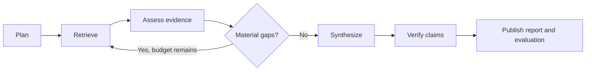

# AI engineering roadmap

## Purpose

Abundance should improve research quality through measurable, inspectable
engineering rather than prompt changes that cannot be reproduced. The product
therefore owns its observability and evaluation contracts. External backends
may receive privacy-safe exports, but they are not the system of record.

The roadmap follows an eval-first rule: establish a baseline, make one bounded
change, compare the result, and promote the change only when quality improves
without violating reliability, latency, or cost budgets.

## Design principles

- Keep orchestration deterministic and capabilities policy-controlled.
- Treat model output and retrieved documents as untrusted data.
- Version graph, prompt, model, dataset, and evaluation contracts.
- Store measurements without prompts, completions, excerpts, or credentials.
- Prefer deterministic checks; use model judges only for semantic properties.
- Make every failed quality gate explainable through stable failure codes.
- Bound adaptive research by rounds, time, search credits, tokens, and cost.

## Phase 1: Abundance observability foundation

Status: in progress on `feat/ai-engineering-v2`.

### Run manifest

Every run emits a versioned manifest alongside its operational metrics. The
manifest identifies the run without retaining its question or response:

- observability schema version;
- application and graph versions;
- run and inquiry identifiers;
- requested model alias and research mode;
- versioned runtime artifacts such as prompts and resolved model IDs;
- start and completion timestamps;
- terminal outcome and public failure code.

The first implementation keeps the manifest inside the existing `run.metrics`
payload so PostgreSQL persists it without a separate telemetry service.

### Run measurements

The internal collector owns:

- total and per-stage duration;
- emitted event, evidence, and claim counts;
- model token and known provider-cost totals;
- terminal outcome and failure classification.

Next increments add provider attempts, retry counts, search latency and yield,
actual fallback provider/model, queue time, and search-credit consumption.

### Privacy boundary

Observability records may contain identifiers, enums, counters, versions,
durations, and failure codes. They must not contain inquiry text, raw prompts,
model completions, evidence excerpts, API keys, authorization headers, or
private provider exceptions.

## Phase 2: Abundance evaluation foundation

Status: in progress on `feat/ai-engineering-v2`.

### Deterministic report metrics

The report evaluator calculates provider-independent signals from the typed
report:

- claim-to-evidence coverage;
- citation integrity;
- evidence utilization;
- counterevidence coverage;
- primary-source ratio;
- source-domain diversity;
- broken references;
- unsupported high-confidence claims;
- unresolved question count.

These metrics describe the report structure. They do not claim that a citation
semantically proves a statement.

### Explainable quality gates

Each threshold produces a structured check containing the metric, comparator,
observed value, threshold, pass/fail result, and stable failure code. Evaluation
runs persist all checks, not only a final score. This makes regressions suitable
for CI and release review.

### Reference datasets

The existing cross-domain dataset remains source controlled. Its next schema
revision should add:

- expected facts and acceptable variants;
- reference primary sources;
- claims that must be challenged;
- time-sensitive cut-off dates;
- explicit abstention expectations;
- safety and prompt-injection fixtures.

Every dataset release must have a unique version. Live comparisons should pin
the code revision, execute at least three trials for stochastic checks, and
report pass rate, variance, latency, and cost.

## Phase 3: Evidence verification

Add a typed `assess_evidence` node after retrieval. It must infer a source's
actual relationship to the research question instead of inheriting the planned
search relation. The assessment records relevance, source class, primary-source
status, publication date, supporting excerpt location, limitations, and a
content hash.

After synthesis, add a `verify_claims` node. It checks whether cited excerpts
support, contradict, or do not establish each claim. Deterministic citation
binding remains mandatory; a semantic judge augments it but cannot introduce
new evidence. Unsupported claims are downgraded, marked, or removed through an
explicit policy.

## Phase 4: Bounded adaptive research

Introduce a gap-analysis node after evidence assessment. It may create
follow-up units only when deterministic coverage rules fail and budget remains.

The loop has hard limits for rounds, parallelism, wall time, search credits,
tokens, and estimated cost. Completion rules and early stopping are visible in
the run manifest.

## Phase 5: Reliability and routing

- Apply retry policies only to classified transient failures.
- Add exponential backoff, jitter, and per-provider circuit breakers.
- Resume a run from its durable checkpoint and preserve an attempt history.
- Make search and model operations idempotent where replay is possible.
- Route planning, synthesis, and verification through separate model profiles.
- Record the actual provider and model selected after fallback.
- Use mode-specific Tavily depth, domain, date, and result budgets.

## Phase 6: Test and release system

Build component suites for planning, retrieval, evidence assessment, synthesis,
and claim verification, followed by end-to-end suites. Add deterministic chaos
fixtures for timeouts, rate limits, malformed schemas, duplicate sources,
contradictions, cancellation, and restart during fan-out.

CI should remain deterministic and credential-free. A scheduled, budget-capped
live canary compares the candidate against the last accepted baseline and
publishes a machine-readable report. Promotion requires explicit quality,
reliability, latency, and cost thresholds.

## Initial delivery criteria

The first increment is complete when:

1. every completed or failed engine run produces a validated manifest;
2. the manifest and metrics contain no research content or secrets;
3. report evaluation exposes the additional deterministic metrics;
4. every quality-gate decision includes an explainable structured check;
5. unit, type, lint, and existing regression tests pass;
6. the public event sequence and stored metrics remain backward compatible.

## Later integration options

The internal contracts can later export sanitized spans and evaluation results
to OpenTelemetry, LangSmith, or another backend. Such integration remains an
adapter: Abundance continues to compute, validate, and persist its own canonical
observability and evaluation records.

Relevant upstream documentation:

- [LangGraph persistence](https://docs.langchain.com/oss/python/langgraph/persistence)
- [LangGraph testing](https://docs.langchain.com/oss/python/langgraph/test)
- [LangSmith evaluation concepts](https://docs.langchain.com/langsmith/evaluation-concepts)
- [OpenRouter model fallbacks](https://openrouter.ai/docs/guides/routing/model-fallbacks)
- [Tavily Search API](https://docs.tavily.com/documentation/api-reference/endpoint/search)
