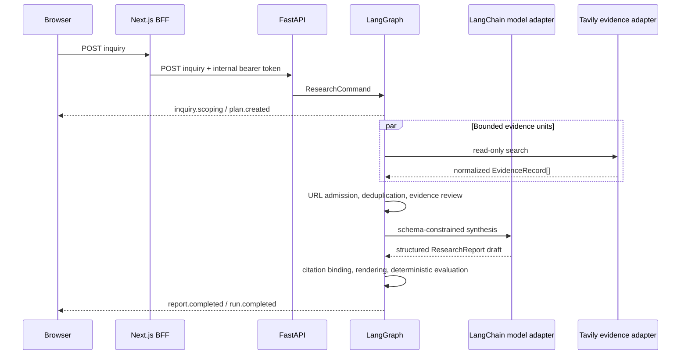
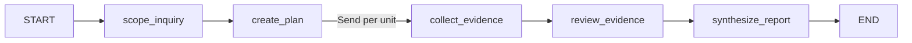

# Architecture

Abundance uses a deterministic LangGraph workflow behind an application-owned
domain and event boundary. LangGraph schedules work; it does not define the
public API or the evidence policy.

## Runtime sequence

## Boundaries

### Domain

`abundance_research.domain` contains Pydantic models for inquiries, plans,
research units, evidence, claims, counterevidence, uncertainty, and reports. It
has no imports from LangGraph, LangChain, FastAPI, or provider SDKs.

### Application

The application layer owns four contracts:

- `PlanningModel` creates a falsifiable plan;
- `EvidenceSource` performs one bounded read-only search;
- `SynthesisModel` produces structured claims referencing evidence IDs;
- `ResearchCommand` is the serializable input to a run.

`application/graph.py` compiles these ports into the following graph:

The graph state uses dictionaries, lists, strings, numbers, and JSON-rendered
Pydantic data so a checkpointer can serialize every superstep. Runtime-only
semaphores live outside checkpointed state and are removed on success, failure,
or cancellation.

### Adapters

The LangChain adapter uses the official `ChatOpenRouter` integration and
Pydantic structured output. It never binds tools. Model aliases are reviewed in
`ModelCatalog`; arbitrary provider IDs are rejected at the HTTP boundary.

The Tavily adapter performs one search per authorized research unit. It returns
normalized evidence records and has no write capability.

### Transport

FastAPI converts `ResearchCommand` into a graph stream and encodes product
events as SSE with monotonic IDs and heartbeat comments. Internal errors stay in
server logs; clients receive stable error codes and correlation IDs.

Next.js authenticates the browser, applies origin and distributed rate-limit
checks, and proxies the response body directly. It does not poll or retain
research jobs in process memory. Aborting the browser request aborts the
upstream fetch and active graph work.

## Streaming contract

Public event types are:

- lifecycle: `run.accepted`, `run.completed`, `run.failed`;
- inquiry and planning: `inquiry.scoping`, `plan.created`;
- evidence: `evidence.collection.started`, `evidence.search.started`,
  `evidence.search.failed`, `evidence.discovered`, `evidence.review.started`;
- synthesis: `synthesis.started`, `report.completed`.

Internal node names, LangGraph update streams, provider response objects, raw
evidence excerpts, and exception strings are deliberately excluded.

## Persistence

The engine accepts any LangGraph `BaseCheckpointSaver`; tests exercise the
in-memory saver and verify JSON-serializable snapshots. The HTTP composition
root currently runs without durable persistence. A production deployment that
needs resume, replay, or multiple API replicas must supply an async Postgres or
Redis checkpointer and define retention and deletion policies.

## Security invariants

1. External content is data, never an instruction or authorization grant.
2. Only HTTP(S) source URLs without credentials are admitted.
3. Tracking parameters and fragments are removed before deduplication.
4. Claims may cite only admitted evidence IDs.
5. Markdown is rendered without raw HTML or arbitrary remote images.
6. The browser cannot select arbitrary provider model identifiers.
7. Production requests require distributed rate limiting and an internal
   service token.
8. Provider exceptions and secrets never cross the public event boundary.

## Quality model

`abundance_research.evaluation` calculates deterministic claim-evidence
coverage, challenged-claim ratio, primary-source ratio, broken evidence links,
and open-question count. These metrics are explainable and do not trigger a
hidden second model pass.
