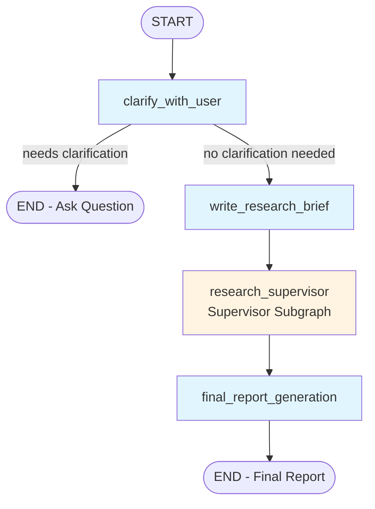
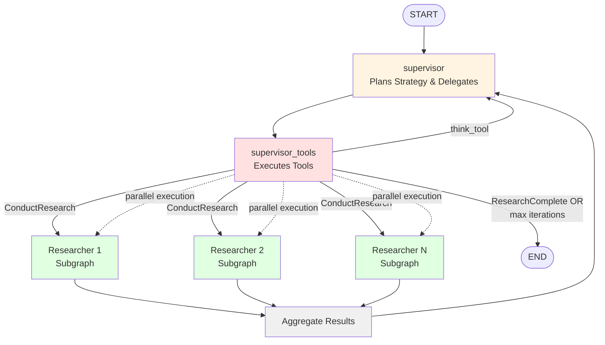
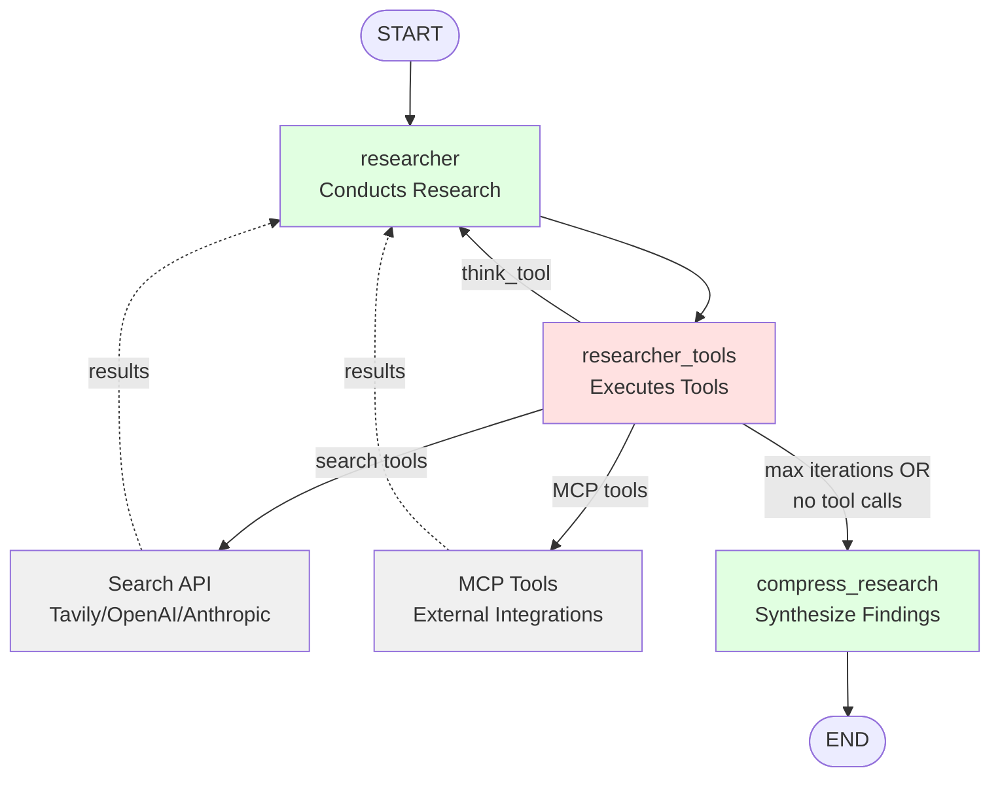
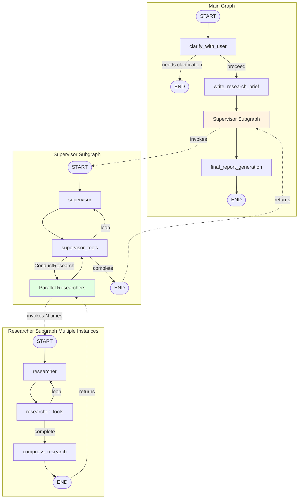
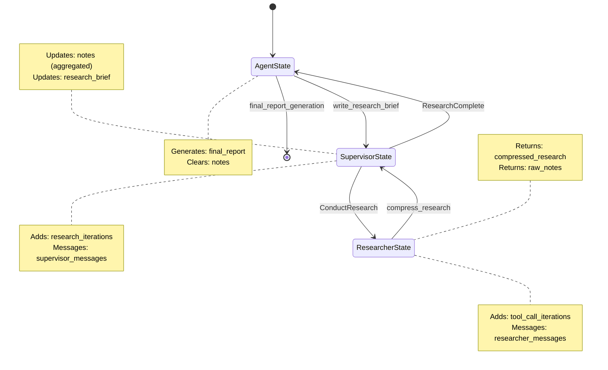

# Open Deep Research - Workflow Architecture

## Complete System Overview

This document provides a visual representation of the multi-agent research workflow using Mermaid diagrams.

## Main Deep Researcher Graph



## Supervisor Subgraph



## Researcher Subgraph



## Complete System Flow



## Key Decision Points

### clarify_with_user
- **Input**: User messages
- **Decision**:
  - If `allow_clarification=False` → skip to write_research_brief
  - If needs clarification → END with question
  - If no clarification needed → proceed to write_research_brief

### supervisor_tools
- **Input**: Tool calls from supervisor
- **Decision**:
  - If `think_tool` → record reflection, continue loop
  - If `ConductResearch` → spawn parallel researchers (up to `max_concurrent_research_units`)
  - If `ResearchComplete` OR `max_researcher_iterations` exceeded → END
  - If no tool calls → END

### researcher_tools
- **Input**: Tool calls from researcher
- **Decision**:
  - If no tool calls and no native search → compress_research
  - If tool calls present → execute in parallel
  - If `max_react_tool_calls` exceeded OR `ResearchComplete` → compress_research
  - Otherwise → continue loop

## Parallel Execution Strategy

### Supervisor Level
```
supervisor_tools → ConductResearch(topic1, topic2, ..., topicN)
                ↓
        asyncio.gather() in parallel
                ↓
        [Researcher1, Researcher2, ..., ResearcherN]
                ↓
        Aggregate compressed results
```

### Researcher Level
```
researcher_tools → [search_call1, search_call2, ..., mcp_call]
                ↓
        asyncio.gather() in parallel
                ↓
        [result1, result2, ..., resultN]
                ↓
        Return to researcher
```

## State Flow



## Node Descriptions

### Main Graph Nodes

| Node | File | Description |
|------|------|-------------|
| `clarify_with_user` | `clarification.py:42` | Analyzes user query, asks clarifying questions if needed |
| `write_research_brief` | `clarification.py:100` | Converts user messages into structured research brief |
| `research_supervisor` | `supervisor.py` | Supervisor subgraph - delegates research to sub-agents |
| `final_report_generation` | `deep_researcher.py:35` | Synthesizes all findings into comprehensive report |

### Supervisor Subgraph Nodes

| Node | File | Description |
|------|------|-------------|
| `supervisor` | `supervisor.py:36` | Plans strategy, uses think_tool and ConductResearch |
| `supervisor_tools` | `supervisor.py:84` | Executes tools, spawns parallel researchers |

### Researcher Subgraph Nodes

| Node | File | Description |
|------|------|-------------|
| `researcher` | `researcher.py:64` | Conducts focused research with search/MCP tools |
| `researcher_tools` | `researcher.py:126` | Executes search/MCP tools in parallel |
| `compress_research` | `researcher.py:203` | Synthesizes research findings into concise summary |

## Tools Available

### Supervisor Tools
- `think_tool`: Strategic reflection
- `ConductResearch`: Delegate research to sub-agent
- `ResearchComplete`: Signal completion

### Researcher Tools
- `think_tool`: Strategic reflection
- Search APIs: Tavily, OpenAI web_search, Anthropic web_search
- MCP Tools: Custom external tools (if configured)
- `ResearchComplete`: Signal individual task completion (not typically used)
